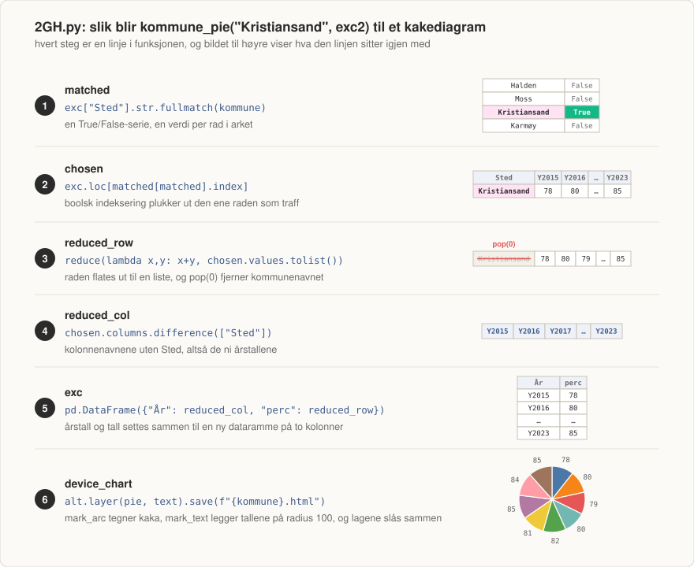

# sparROW

Oppgaver fra IS-114 ved Universitetet i Agder, høsten 2024. Oppgave 1 er ren Python: funksjoner,
klasser, lister og ordbøker, flere av dem med `assert`-tester i selve filen. Oppgave 2 leser et
regneark med pandas og tegner diagrammer med Altair. Noen tidlige forsøk i Pyret ligger igjen som
`.arr`-filer.

Hver funksjon har et flytdiagram i `images/` eller `images2/`. Diagrammet under tar det ett hakk
lenger og viser stegene i `kommune_pie`, den mest sammensatte funksjonen i repoet.



## Kjøre koden

Åpne terminalen, gå inn i `sparROW/` og installer avhengighetene:

```
pip install -r requirements.txt
```

Altair er låst til `altair<5` i `requirements.txt`. Versjon 5 flyttet på modulen `altair.vegalite.v4`,
og da faller koden gjennom med `ModuleNotFoundError`. Se
[tråden på Streamlit-forumet](https://discuss.streamlit.io/t/modulenotfounderror-no-module-named-altair-vegalite-v4/45915).

Filene er frittstående og kjøres en og en:

```
python 1A.py
```

`2ABCDEF.py` og `2GH.py` må kjøres fra rotmappa i repoet, siden de leser `oppgave2_rounded.xlsx`
med relativ sti. Begge funksjonene i `2GH.py` skriver hver sin HTML-fil i mappa du står i.

## Struktur

| Fil | Tema |
|-----|------|
| `1A.py` | Lengde og maksverdi, med `assert` som test |
| `1B.py` | Klasser: studenter plassert i grupper |
| `1C1.py` | Regnestykke med avrunding i testen |
| `1C2.py` | Lister: fortegn, strenglengde og partall |
| `1C3.py` | Samme filtrering skrevet med løkke og med `filter` |
| `1C4.py` | Ordbøker: slå opp, endre og slette rom i et bygg |
| `2ABCDEF.py` | Høyest, lavest og gjennomsnitt fra regnearket |
| `2GH.py` | Kakediagrammer med Altair, lagret som HTML |
| `oppgave2.xlsx` | Rådataene, prosenttall per kommune for 2015 til 2023 |
| `oppgave2_rounded.xlsx` | Samme data avrundet, og den koden faktisk bruker |
| `1B.arr`, `1C2.arr`, `2AB.arr` | Pyret-forsøk som ble erstattet av Python-filene |
| `images/`, `images2/` | Flytdiagrammer for oppgave 1 og oppgave 2 |

## Oppgave 1

### 1A.py

| Funksjon | Beskrivelse |
|----------|-------------|
| `my_str_len(l)` | Lengden på strengen i lista |
| `my_num_max(l)` | Største tall i lista |

Begge har en egen `test_`-funksjon som kalles nederst i fila. Endrer du verdien i `assert`, stopper
kjøringen med `AssertionError`. Det er hele poenget med testene her.

### 1B.py

Klassene `Gruppe` og `Student` bygges opp med `__init__`. Tre grupper (`1-B`, `2-B`, `3-B`) får hver
sin mentor, og tre studenter får navn, fødselsår og et gruppenummer.

| Funksjon | Beskrivelse |
|----------|-------------|
| `check_group(student_type, group_number)` | Returnerer gruppenummeret hvis studenten hører til gruppa |

Studenten lagrer `group_1B.id`, altså strengen `"1-B"`, ikke selve gruppeobjektet. Derfor
sammenligner `check_group` to strenger.

### 1C1.py

| Funksjon | Beskrivelse |
|----------|-------------|
| `moonie(earthie)` | Vekt på jorda ganget med `1/6`, altså vekt på månen |

Testen runder av før den sammenligner: `round(moonie(100)) == 17`.

### 1C2.py

| Funksjon | Beskrivelse |
|----------|-------------|
| `num_to_str(liste)` | Bytter hvert tall mot `"neg"`, `"zero"` eller `"pos"` |
| `find_str_len(liste)` | Sier om lista inneholder en streng på fem tegn |
| `even_num(liste)` | Plukker ut partallene mellom 10 og 20 |

`num_to_str` runder av først, så `-0.4` blir `"zero"` og ikke `"neg"`. `even_num` bruker
intervallsammenligning (`10 <= element <= 20`) og `%` for å skille partall fra oddetall.

### 1C3.py

| Funksjon | Beskrivelse |
|----------|-------------|
| `all_z_words(wordlist)` | Ord som inneholder `z`, funnet med løkke |
| `all_z_words_f(wordlist)` | Samme svar, men med `filter` og `lambda` |

De to funksjonene er den samme oppgaven løst på to måter. Løkkeversjonen bygger lista med
`zlist = [wd] + zlist`, som betyr at svaret kommer i motsatt rekkefølge av input.

### 1C4.py

Ordboka `building_B` har tre rom med hvert sitt antall plasser: `B1007: 500`, `B1006: 400`,
`B1005: 49`.

| Funksjon | Beskrivelse |
|----------|-------------|
| `room_size(selection, building)` | Skriver ut antall plasser i ett rom |
| `change_size(selection, building, free, add)` | Legger til eller trekker fra plasser, styrt av `add` |
| `min_size()` | Sletter alle rom med under 50 plasser |

Funksjonene kjøres etter hverandre nederst i fila og endrer den samme ordboka underveis. `B1007`
går fra 500 til 510, og `B1005` forsvinner helt.

## Oppgave 2

Datasettet er prosenttall per kommune fra 2015 til 2023, 458 rader i kolonnene `Sted` og `Y2015`
til `Y2023`. Alle funksjonene i begge filene tar `exc2`, altså `oppgave2_rounded.xlsx`.

### 2ABCDEF.py

| Funksjon | Oppgave | Beskrivelse |
|----------|---------|-------------|
| `highest(exc)` | A | Kommunen med høyest prosent i 2023 |
| `lowest(exc)` | B | Kommunen med lavest prosent i 2023 |
| `meanest(exc)` | D og E | Høyest og lavest gjennomsnitt over alle ni årene |
| `meanest_OVR(exc, year)` | F | Gjennomsnittet for ett valgt år |

De tre første begynner likt: `fixed = exc[(exc != 0).all(1)]` kaster ut alle rader som har et
nulltall i seg, og så sorteres det som er igjen med `sort_values`. `iloc[0]` plukker første rad
etter sorteringen. `meanest` legger først på en kolonne `mean` med `fixed.iloc[:, 1:].mean(axis=1)`,
altså snittet av alle årskolonnene, og sorterer på den.

Med `oppgave2_rounded.xlsx` gir A og B `Modalen` med 143 prosent og `Etnedal` med 56 prosent, mens
D og E gir `Modalen` med 128 og `Hægebostad` med 61.


### 2GH.py

| Funksjon | Oppgave | Beskrivelse |
|----------|---------|-------------|
| `kommune_pie(kommune, exc)` | G | Kakediagram over årene for en kommune |
| `kommune_top10(exc)` | H | Kakediagram over kommunene med høyest gjennomsnitt |

`kommune_pie` er tegnet steg for steg øverst i denne README-en. Kort fortalt: `str.fullmatch` gir en
True/False-serie, `exc.loc[...]` plukker raden som traff, `reduce` flater raden ut til en vanlig
liste, `pop(0)` fjerner kommunenavnet, og resten settes sammen med kolonnenavnene til en ny
dataramme. Så bygges diagrammet: `mark_arc` tegner kaka, `mark_text` legger tallene utenpå på
radius 100, og `alt.layer` slår de to lagene sammen før `save` skriver `Kristiansand.html`.

`kommune_top10` gjør det samme, men mater kaka med en annen dataramme: nullradene fjernes, en
`mean`-kolonne legges på, tabellen sorteres synkende, og toppen tas med `head`. Navn og snitt
hentes ut i hver sin liste med en `for`-løkke før de settes sammen igjen. Resultatet lagres som
`top10.html`.

| Diagram | Fil |
|---------|-----|
| Steg for steg gjennom `kommune_pie` | `images2/kommune-pie.svg` |
| Flytdiagram for `kommune_pie` | `images2/kommune_pie.png` |
| Flytdiagram for `kommune_top10` | `images2/kommune_top10.png` |

## Bilder

| Fil | Diagrammer |
|-----|------------|
| `1A.py` | `images/my_str_len_AND_my_max.png` |
| `1B.py` | `images/check_group.png` |
| `1C1.py` | `images/moonie.png` |
| `1C2.py` | `images/num_to_str.png`, `images/find_str_len.png`, `images/even_num.png` |
| `1C3.py` | `images/all_z_words.png`, `images/all_z_words_f.png` |
| `1C4.py` | `images/room_size.png`, `images/change_size.png`, `images/min_size.png` |
| `2ABCDEF.py` | `images2/hlmm.png` |
| `2GH.py` | `images2/kommune-pie.svg`, `images2/kommune_pie.png`, `images2/kommune_top10.png` |

Flytdiagrammene bruker samme formspråk hele veien: grønn avrundet boks er start og slutt, blå
firkant er et steg i koden, rosa parallellogram er data inn eller ut, lilla er regnearket, og hvit
rombe er en test som svarer sant eller usant.

## Merknader

- `oppgave2.xlsx` mangler kolonnenavn på den første kolonnen, og pandas kaller den derfor
  `Unnamed: 0`. Alt som slår opp `exc["Sted"]` stopper med `KeyError` på den fila. `exc2` er lest
  inn og merket `# Bruk denne` i begge oppgave 2-filene av akkurat den grunnen.
- `(exc != 0).all(1)` fjerner 131 av de 458 radene. Det er kommuner som ikke har tall for alle
  årene, stort sett fordi de ble slått sammen eller delt i perioden, og som står med `0` i stedet.
- `meanest_OVR` regner snittet uten å fjerne nullradene først, i motsetning til de tre andre
  funksjonene i samme fil. For `Y2023` gir det 68 prosent, mens de 327 radene som faktisk har tall
  gir 87.
- `kommune_top10` bruker `head(11)`, så kaka får elleve kommuner og ikke ti.
- `kommune_pie` bygger lista med `pop(0)` og kolonnene med `columns.difference(["Sted"])`. Det
  første forutsetter at `Sted` er første kolonne, det andre at kolonnene sorterer alfabetisk i
  samme rekkefølge som i arket. Begge deler stemmer her fordi `Y2015` til `Y2023` sorterer likt,
  men det er en forutsetning og ikke en garanti.
- `fixed["mean"] = ...` skriver til et utsnitt av datarammen, og pandas svarer med
  `SettingWithCopyWarning`. Advarselen kan ignoreres, resultatet blir riktig.
- `my_str_len` har `return` inni løkka og måler derfor bare det første elementet. Testen går
  gjennom fordi lista i testen har akkurat ett element.
- `find_str_len` returnerer `True` med en gang den finner en streng på fem tegn, og `None` hvis den
  ikke finner noen. Den svarer altså aldri `False`.
- Oppgave C i `2ABCDEF.py` er hoppet over med vilje. Den spør om det samme som E, slik kommentaren
  i fila påpeker.
- To utskrifter i `2ABCDEF.py` mangler mellomrom rundt innsettingene: `er{lowest_column...}` og
  `{...}med`.
- `1B.arr`, `1C2.arr` og `2AB.arr` kan ignoreres. De var feil oppgave eller ufullstendige, og ble
  erstattet av Python-filene. `check-group` i `1B.arr` kaller for eksempel seg selv med en `Gruppe`
  der signaturen krever en `Student`, og `where:`-blokken tester feltet `student.group` i stedet for
  selve funksjonen.
- `images/hlmm.png` og `images2/hlmm.png` er den samme fila. Diagrammet hører til oppgave 2.
